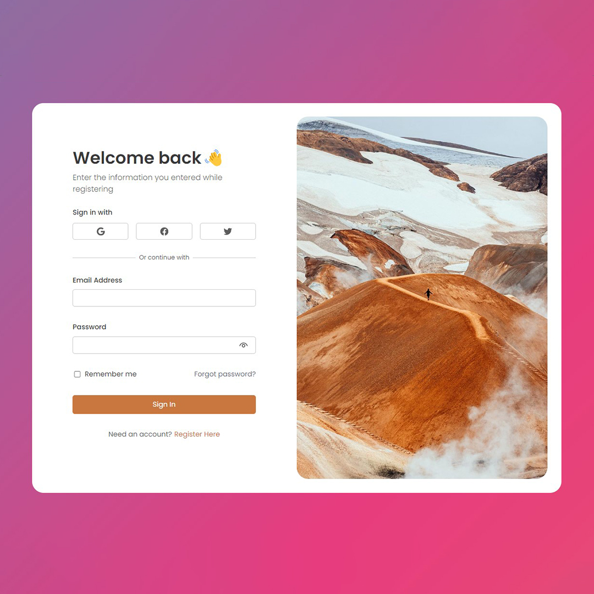
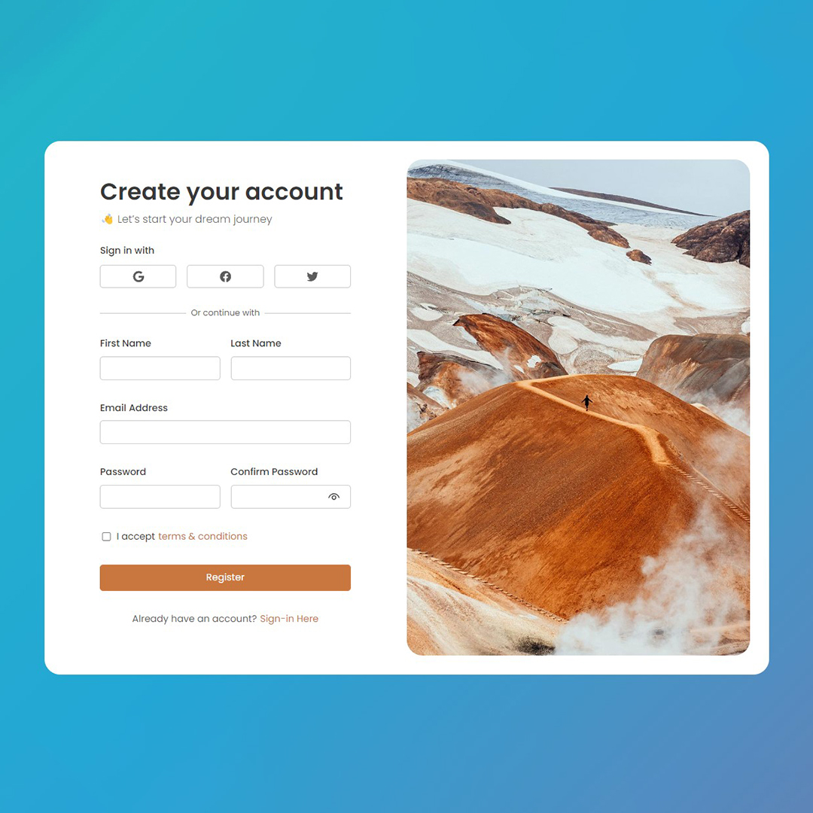

# React Login Form

A React login form built with Formik and Yup is a common approach to creating a secure and user-friendly authentication system in a React application.

React login form built with Formik and Yup combines the power of React for user interfaces, Formik for form management, and Yup for validation to create a robust and user-friendly authentication experience in a web application. This approach ensures that user input is validated according to specified rules and enhances the security and usability of the login process.

## Requirements

- Basic HTML, CSS & Javascript knowledge.
- Basic React JS knowledge.
- Basic Formik and Yup.

## How to Install & Run

To run the application, follow these steps:

1. Clone the repository or download it as a ZIP file.
2. In a terminal, navigate to the folder where the application is located.
3. Run the **npm install** command to install all the necessary dependencies.

```shell
npm install
```

4. Run the **npm run dev** command to start the application in development mode.

```shell
npm run dev
```

5. Open your browser and navigate to **http://localhost:5173** to use the application.

```shell
http://localhost:5173
```

## Application Features

React login form built with Formik and Yup has the following features:

- Form management.
- Form validation.
- User-friendly Authentication.

## Technologies Used

React login form built with Formik and Yup uses the following technologies:

- React JS
- Formik
- Yup
- React Hooks
- React Router DOM

## Contribution

If you'd like to contribute to this project, feel free to submit a pull request. Before doing so, be sure to create a separate branch for your changes.

## Buy A Coffee

Like my works and want to support me?

<a href="https://www.buymeacoffee.com/hossainpalin" target="_blank"></a>

## Screenshots




## Live demo

Live previews are the best way for a better understanding of the application's user interface.

[Click here...](https://hossainpalin.github.io/react-login-form/)
